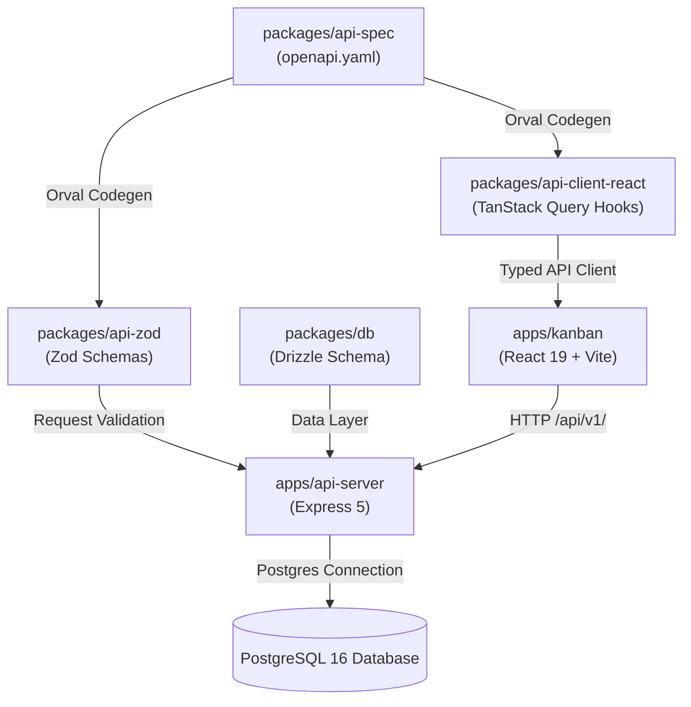

# Architecture

## System Overview

Kanban Task Board is structured as a contract-first full-stack monorepo powered by `pnpm` workspaces.



---

## Monorepo Layout & Package Roles

| Package / App | Path | Type | Role |
|---|---|---|---|
| `@workspace/api-server` | `apps/api-server` | Node App | Express 5 REST API, session authentication, PostgreSQL connection, business logic |
| `@workspace/kanban` | `apps/kanban` | React App | Vite + React 19 SPA, Tailwind CSS v4, Radix UI primitives, drag-and-drop board |
| `@workspace/api-spec` | `packages/api-spec` | Package | OpenAPI 3.0 YAML definition and Orval code-generation configuration |
| `@workspace/api-zod` | `packages/api-zod` | Package | Zod schemas and TypeScript request/response types compiled from OpenAPI |
| `@workspace/api-client-react` | `packages/api-client-react` | Package | React Query hooks and custom fetch client compiled from OpenAPI |
| `@workspace/db` | `packages/db` | Package | Drizzle ORM schema definitions and PostgreSQL database connection factory |

---

## Data Flow & API Request Lifecycle

1. **Client Request:** Frontend components call generated React Query hooks from `@workspace/api-client-react`.
2. **HTTP Dispatch:** Requests hit the `/api/v1/` prefix with session cookies automatically included (`credentials: 'include'`).
3. **Session Authentication:** `express-session` backed by PostgreSQL (`connect-pg-simple`) extracts user session.
4. **Endpoint Guard:** `requireAuth` middleware verifies user session on private endpoints.
5. **Schema Validation:** Handlers validate request payloads using schemas from `@workspace/api-zod`.
6. **Data Operation:** Database queries execute via Drizzle ORM through `@workspace/db`.
7. **Typed Response:** Response JSON is returned to the client and typed automatically via React Query.

---

## Database Schema Model (`packages/db/src/schema/`)

```
users (id, email, password_hash, first_name, last_name, avatar_url, created_at, updated_at)
  │
  ├──< team_members (id, team_id, user_id, role, created_at) >── teams (id, name, created_by, invite_code, created_at)
  │                                                                 │
  ├──< board_members (id, board_id, user_id, role)                  │
  │         │                                                       │
  │         v                                                       v
  └──< boards (id, name, owner_id, team_id, background_color, created_at, updated_at)
             │
             └──< columns (id, board_id, title, position, color, created_at)
                    │
                    └──< tasks (id, column_id, title, description, priority, position,
                                due_date, assignee_id, tags, created_at, updated_at)
```

### Table Definitions

| Table | Description |
|---|---|
| `users` | User credentials, profile names, avatar URLs, timestamps |
| `teams` | Workspace teams with shareable invite codes |
| `team_members` | Team membership linking users to teams with roles (`owner`, `admin`, `member`) |
| `team_invites` | Pending email invitations with unique tokens and expiration timestamps |
| `boards` | Kanban boards owned by a user or optionally attached to a team |
| `board_members` | Direct user-to-board access permissions (`admin`, `editor`, `viewer`) |
| `columns` | Ordered swimlanes belonging to a board (`Backlog`, `In Progress`, `Done`, etc.) |
| `tasks` | Kanban cards with ordering position, priority, tags, assignee, due date |
| `session` | PostgreSQL session store managed by `connect-pg-simple` |

---

## Authentication & Security

- **Session Management:** Stored server-side in PostgreSQL `session` table with signed session cookies (`SESSION_SECRET`).
- **Password Hashing:** Scrypt key derivation / bcryptjs with salt rounds.
- **Access Control:** `getBoardAccess()` helper checks board ownership, direct `board_members` role, or parent `team_members` role before allowing read/write operations.
